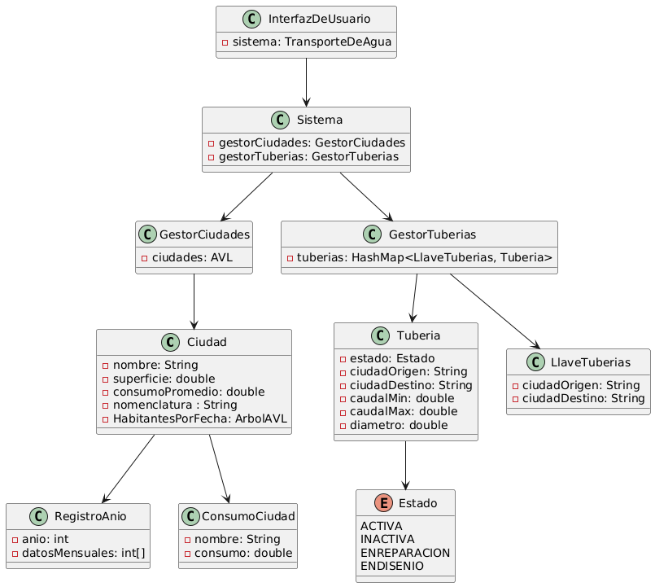
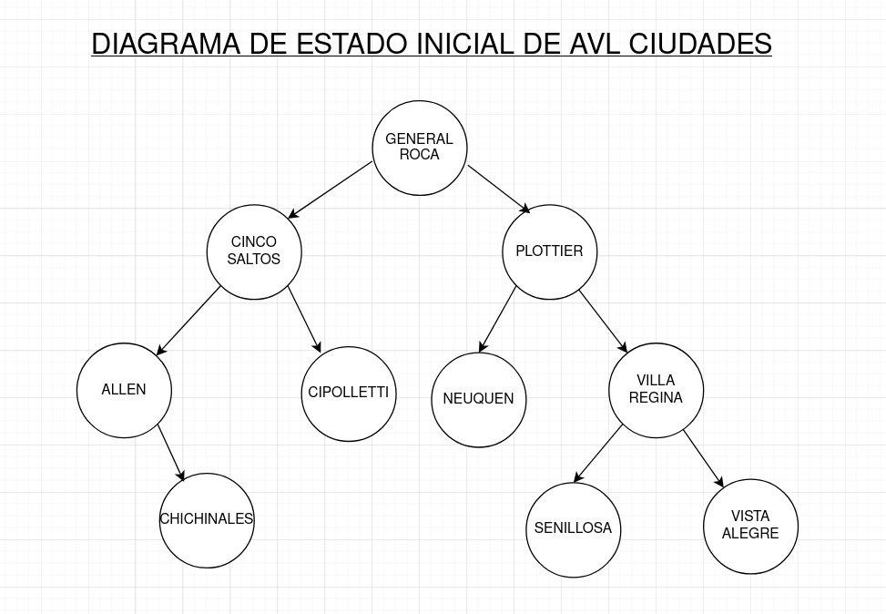
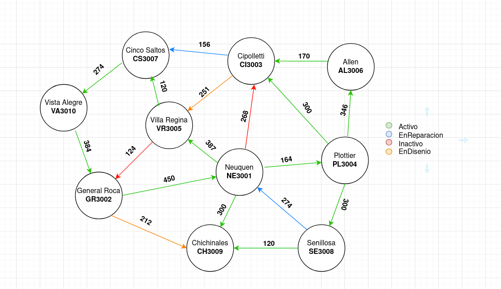

# Trabajo final EDAT 2025

Participantes:
- Malena Sofia Huilcaleo <malena.huilcaleo@est.fi.uncoma.edu.ar>
- Florencia Granchelli Martinez <florencia.granchelli@est.fi.uncoma.edu.ar>
- Nicolas Augusto Salas <nicolas.salas@est.fi.uncoma.edu.ar>

Se adjunta el zip que contiene el proyecto. El enlace al repositorio hosteado en github: https://github.com/fuzzdistor/edat-final

Se tomaron en cuenta los aspectos a corregir del proyecto y se corrigieron la copia innecesaria de la lista dentro del método de caminoMasCorto de grafo como también la creación de un nuevo nodo en el diccionario al momento de eliminar para que quede más alineado a la implementación que se discutió del AVL común.

Diagrama de clases:

AVL de ciudades:

Grafo de tuberías:

